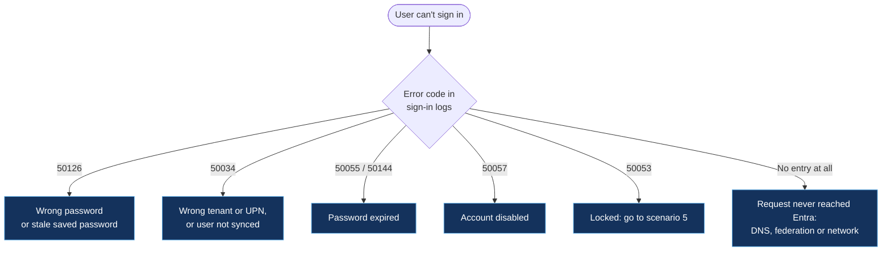
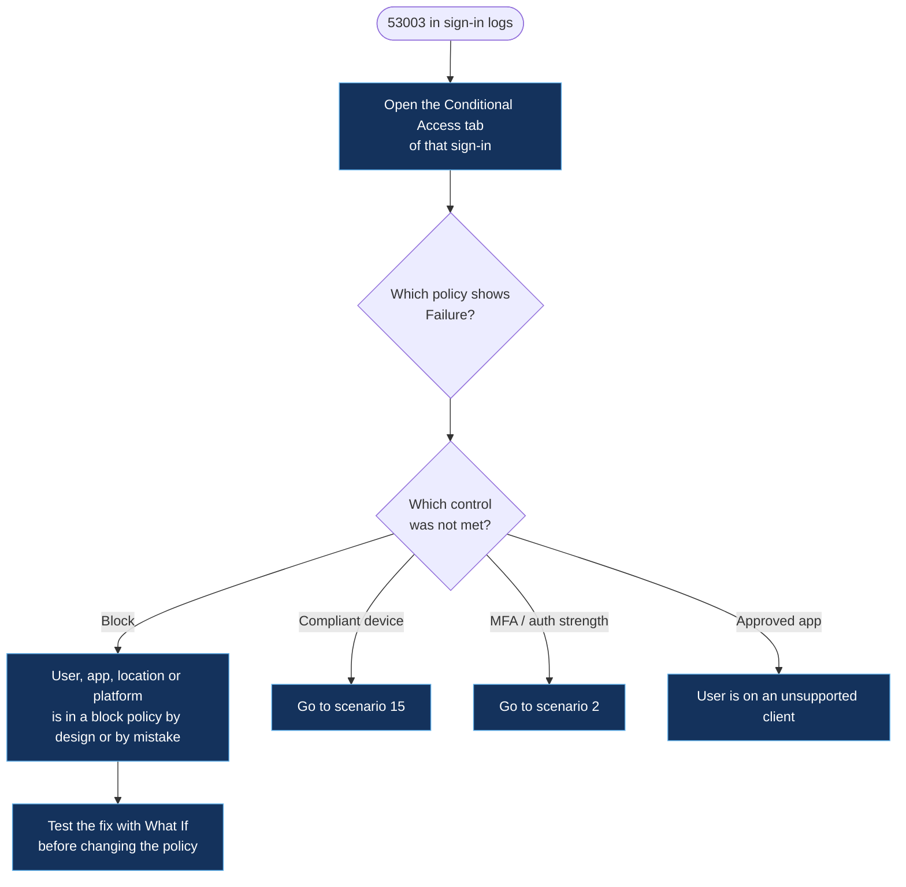

# Sign-in and authentication

[← Back to the playbook](../README.md)

| # | Scenario | Typical codes |
|---|---|---|
| 1 | [User can't sign in](#1-user-cant-sign-in) | 50126 · 50034 · 50055 · 50057 |
| 2 | [MFA problems](#2-mfa-problems) | 50074 · 50076 · 500121 · 50158 |
| 3 | [Blocked by Conditional Access](#3-blocked-by-conditional-access) | 53003 · 530032 |
| 4 | [Legacy authentication blocked](#4-legacy-authentication-blocked) | 53003 with a legacy client app |
| 5 | [Account lockout loop](#5-account-lockout-loop) | 50053 |
| 6 | [Repeated sign-in prompts](#6-repeated-sign-in-prompts) | 70043 · 50133 · 50173 · 700082 |

**Start every sign-in case the same way:** open the user's entry in the sign-in logs and read three things: the **error code**, the **Conditional Access** tab and the **Authentication details** tab. Those three answer most cases before you change anything.

---

## 1. User can't sign in

**What the user sees:** "Your account or password is incorrect", "Your account has been locked" or "We couldn't find an account with that username".



| Cause | How to confirm | Fix |
|---|---|---|
| Wrong or old password | `50126` in sign-in logs; many attempts from one device | Reset password, or have the user update saved credentials on phones and mapped drives |
| User not in this tenant | `50034`; check the UPN suffix the user typed | Correct the UPN; if hybrid, check the user is in sync scope |
| Password expired | `50055` (cloud) or `50144` (on-premises password) | Reset, or direct the user to self-service password reset |
| Account disabled | `50057`; **Account enabled** is off on the user | Confirm with HR or the manager why, then re-enable |
| No sign-in log entry | Nothing logged for the attempt | The request never arrived. Check DNS, proxy, and AD FS if the domain is federated (scenario 13) |

**Where to look:** Entra admin center → Sign-in logs (filter by user) · the user's profile → Account status.

```kusto
// Last 20 failed sign-ins for one user, with the reason
SigninLogs
| where TimeGenerated > ago(24h)
| where UserPrincipalName =~ "user@contoso.com" and ResultType != "0"
| project TimeGenerated, ResultType, ResultDescription, AppDisplayName, IPAddress, ClientAppUsed,
          Device = tostring(DeviceDetail.displayName)
| top 20 by TimeGenerated desc
```

**Prevent it:** enable self-service password reset with at least two methods · move to passwordless (Authenticator, FIDO2, Windows Hello) so there is no password to forget.

---

## 2. MFA problems

**What the user sees:** no prompt arrives, the prompt is denied or times out, or they are asked to register again.

| Cause | How to confirm | Fix |
|---|---|---|
| User denied, ignored or never got the prompt | `500121`; **Authentication details** shows the method and "denied" or "timed out" | Check phone notifications and connectivity; offer a second method |
| New phone, old registration | Method listed is a device the user no longer has | Verify identity, then **Require re-register multifactor authentication** |
| No method registered yet | `50072` or `50079` (enrolment required) | Send the registration link; issue a Temporary Access Pass if they can't complete it |
| Registration blocked because the user is risky | `53004` | Admin remediates the risk first (scenario 21), then the user registers |
| Third-party MFA provider failed | `50158` (external challenge not satisfied) | Check the external provider's status and its integration settings |
| Repeated unexpected prompts the user did not start | Many `500121` denials in minutes | **Treat as an attack (MFA fatigue).** Reset the password and revoke sessions |

**Where to look:** Sign-in logs → Authentication details · User → Authentication methods · Authentication methods → Registration and usage reports.

```kusto
// MFA failures by user and method in the last 24 hours
SigninLogs
| where TimeGenerated > ago(24h) and ResultType in ("500121", "50074", "50076", "50158")
| mv-expand Step = todynamic(AuthenticationDetails)
| summarize Failures = count() by UserPrincipalName, Method = tostring(Step.authenticationMethod), ResultType
| order by Failures desc
```

**Prevent it:** number matching and location context in Authenticator (default) · require two registered methods · Temporary Access Pass process for lost devices.

---

## 3. Blocked by Conditional Access

**What the user sees:** "You cannot access this right now" or "Your sign-in was successful but does not meet the criteria to access this resource".



| Cause | How to confirm | Fix |
|---|---|---|
| Location not in a trusted or allowed list | Policy with a location condition shows Failure; check the IP in the sign-in | Add the egress IP to the named location, or the user connects from an allowed network |
| Device platform or client app excluded | Conditions tab shows the platform or client app that matched | Use a supported app, or adjust the policy scope |
| User in the wrong group | Policy applies through a group the user shouldn't be in (or is missing an exclusion) | Fix group membership rather than the policy |
| New policy turned on without testing | Many users blocked at the same time, right after a change in the audit logs | Set the policy to **Report-only**, review impact, then re-enable |

**Where to look:** Sign-in logs → Conditional Access tab · Conditional Access → **What If** · Audit logs filtered to the Conditional Access category.

```kusto
// Which Conditional Access policies are blocking, and how many users each one affects
SigninLogs
| where TimeGenerated > ago(24h) and ResultType == "53003"
| mv-expand Policy = ConditionalAccessPolicies
| where Policy.result == "failure"
| summarize Users = dcount(UserPrincipalName), Blocks = count() by PolicyName = tostring(Policy.displayName)
| order by Users desc
```

**Prevent it:** every new policy starts in Report-only · break-glass accounts excluded from all policies (scenario 24) · one policy per purpose, named so the block reason is obvious.

---

## 4. Legacy authentication blocked

**What the user sees:** an old mail client, scanner, printer or script stops connecting; modern apps keep working.

| Cause | How to confirm | Fix |
|---|---|---|
| Client uses basic authentication (IMAP, POP, SMTP AUTH, older Office) | Sign-in logs → **Client app** shows a legacy protocol; result is `53003` from the "block legacy authentication" policy | Move the client to modern authentication (OAuth) |
| Device can't do modern authentication at all | Scanner or line-of-business device with username and password only | Use a relay or a supported connector; do not exclude the account from the block policy |
| Script using stored username and password | Non-interactive sign-ins from a server IP | Replace with an app registration and certificate, or a managed identity |

**Where to look:** Sign-in logs → add filter **Client app** → select all legacy authentication clients.

```kusto
// Who is still using legacy authentication, and from where
SigninLogs
| where TimeGenerated > ago(7d)
| where ClientAppUsed !in ("Browser", "Mobile Apps and Desktop clients")
| summarize Attempts = count(), LastSeen = max(TimeGenerated) by UserPrincipalName, ClientAppUsed, AppDisplayName
| order by Attempts desc
```

**Prevent it:** run this query before enabling the block policy, so owners are warned ahead of time.

---

## 5. Account lockout loop

**What the user sees:** the account unlocks, then locks again within minutes.

| Cause | How to confirm | Fix |
|---|---|---|
| Old password saved on a phone, tablet or mapped drive | `50053`, with repeated `50126` from one device or IP just before | Update or remove the saved credential on that device |
| Service or scheduled task running as the user | Failures come from a server at regular intervals | Move it to a service account or managed identity |
| Password spray against the account | Failures from many unfamiliar IPs and countries | Not a user problem. Smart lockout is working; block the sources and check for a successful sign-in among them |
| On-premises lockout (hybrid) | Security event `4740` on the PDC emulator names the source computer | Fix the credential on the source computer |

**Where to look:** Sign-in logs for the user · on-premises: Security log on the PDC emulator (`4740` locked out, `4625` failed logon, `4771` Kerberos pre-authentication failed).

```kusto
// What is locking this account: device, app and IP behind the bad passwords
SigninLogs
| where TimeGenerated > ago(24h) and UserPrincipalName =~ "user@contoso.com"
| where ResultType in ("50053", "50126")
| summarize Attempts = count(), First = min(TimeGenerated), Last = max(TimeGenerated)
          by IPAddress, AppDisplayName, ClientAppUsed, Device = tostring(DeviceDetail.displayName)
| order by Attempts desc
```

**Prevent it:** passwordless sign-in · tune smart lockout threshold and duration · never run services under a person's account.

---

## 6. Repeated sign-in prompts

**What the user sees:** asked to sign in again several times a day, or "Your session has expired".

| Cause | How to confirm | Fix |
|---|---|---|
| Sign-in frequency policy is short | `70043` in non-interactive sign-ins; a Conditional Access policy has a session control | Lengthen the frequency for managed devices; keep it short only for unmanaged ones |
| Password was changed or reset | `50133` or `50173` right after a password event in the audit logs | Expected. The user signs in once with the new password |
| Sessions were revoked by an admin or by automation | `50173`; audit log shows "Revoke sign-in sessions" | Expected after a compromise response. Tell the user why |
| Token expired after long inactivity | `700082` | Expected. One fresh sign-in fixes it |
| Device has no Primary Refresh Token | `dsregcmd /status` shows `AzureAdPrt : NO` | Go to scenario 15 |
| Browser blocks cookies or uses private mode | Only happens in one browser | Allow cookies for `login.microsoftonline.com` |

**Where to look:** Sign-in logs → **User sign-ins (non-interactive)** tab · Conditional Access → policies with **Session** controls.

```kusto
// How often is each user being re-prompted, and why
union SigninLogs, AADNonInteractiveUserSignInLogs
| where TimeGenerated > ago(24h) and ResultType in ("70043", "50133", "50173", "700082")
| summarize Prompts = count() by UserPrincipalName, ResultType, AppDisplayName
| order by Prompts desc
```

**Prevent it:** one sign-in frequency policy per device state, not several overlapping ones · hybrid or Entra-joined devices so single sign-on works through the Primary Refresh Token.

---

[← Back to the playbook](../README.md) · [Next: Applications →](02-applications.md)
