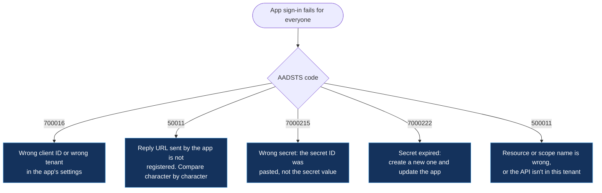

# Applications and single sign-on

[← Back to the playbook](../README.md)

| # | Scenario | Typical codes |
|---|---|---|
| 7 | [App fails to authenticate (OAuth / OpenID Connect)](#7-app-fails-to-authenticate) | 700016 · 7000215 · 7000222 · 50011 · 500011 |
| 8 | [SAML single sign-on failure](#8-saml-single-sign-on-failure) | 75011 · 75005 · 50008 · 50105 |
| 9 | [User not assigned, or consent missing](#9-user-not-assigned-or-consent-missing) | 50105 · 65001 · 65004 · 90094 |
| 10 | [Service principal or workload identity failing](#10-service-principal-or-workload-identity-failing) | 7000215 · 7000222 · 53003 |

**First question for every app case:** is it failing for *everyone* or for *one person*? Everyone means configuration (scenarios 7, 8, 10). One person means assignment, consent or their own sign-in (scenario 9, or the sign-in page).

---

## 7. App fails to authenticate

**What the user sees:** an error page from Microsoft with an `AADSTS` code, before the app loads.



| Cause | How to confirm | Fix |
|---|---|---|
| Client secret or certificate expired | `7000222`; App registration → Certificates & secrets shows an expired entry | Add a new credential, update the app, remove the old one |
| Reply URL mismatch | `50011`; the error text shows the URL the app sent | Add exactly that URL under Authentication (scheme, case and trailing slash matter) |
| Wrong client ID or tenant | `700016` | Correct the application (client) ID and the tenant in the app's config |
| Wrong secret value | `7000215` | Use the secret **value**, not the secret ID |
| API or scope not found | `500011` | Correct the resource identifier or scope; confirm the API's service principal exists in the tenant |
| App is single-tenant but the user is external | `50020` or `90072` | Invite the user as a guest, or make the app multi-tenant if that is intended |

**Where to look:** App registrations → the app → Authentication, Certificates & secrets, API permissions · Sign-in logs filtered by application.

```kusto
// Apps whose sign-ins started failing in the last day, with the code
SigninLogs
| where TimeGenerated > ago(24h) and ResultType in ("700016", "7000215", "7000222", "50011", "500011")
| summarize Failures = count(), Users = dcount(UserPrincipalName), FirstSeen = min(TimeGenerated)
          by AppDisplayName, ResultType, ResultDescription
| order by Failures desc
```

**Prevent it:** track secret and certificate expiry and alert owners ahead of time (the same idea as the [SAML certificate lifecycle](https://github.com/samikshya-dash/identity-security-automation/tree/main/saml-cert-lifecycle) project) · prefer certificates or managed identities over secrets.

---

## 8. SAML single sign-on failure

**What the user sees:** an error on the Microsoft sign-in page, *or* the Microsoft sign-in succeeds and the app itself shows an error.

That difference tells you which side to fix:

| Where the error appears | What it means | Look at |
|---|---|---|
| Microsoft page with an `AADSTS` code | Entra rejected the app's request | Identifier, Reply URL and the request the app sent |
| The app's own page | Entra issued a token; the app rejected it | Signing certificate, NameID and claims the app expects |

| Cause | How to confirm | Fix |
|---|---|---|
| Signing certificate expired or rotated | App reports "invalid signature" or "certificate not trusted"; certificate expiry date has passed or changed | Upload the active certificate to the app, or re-import federation metadata |
| Identifier (Entity ID) mismatch | `700016` with the identifier the app sent | Set the Identifier in Entra to exactly what the app sends |
| Reply URL (ACS) mismatch | `50011` | Add the app's Assertion Consumer Service URL |
| NameID or claim not what the app expects | App says "user not found" although sign-in succeeded | Change the **Unique User Identifier** claim (often email versus UPN) to match the app's user records |
| App demands a specific authentication method | `75011` | Remove `RequestedAuthnContext` from the app's request, or align the method |
| Malformed SAML request | `75005` | Fix the request encoding or binding on the app side |
| User not assigned | `50105` | Scenario 9 |

**Where to look:** Enterprise applications → the app → Single sign-on → **Test** (it explains the failure and proposes the fix) · a SAML tracer browser extension to read the request and response.

```kusto
// SAML and SSO failures per enterprise app over the last 7 days
SigninLogs
| where TimeGenerated > ago(7d) and ResultType in ("75011", "75005", "50008", "50105", "50011", "700016")
| summarize Failures = count(), Users = dcount(UserPrincipalName) by AppDisplayName, ResultType, ResultDescription
| order by Failures desc
```

**Prevent it:** certificate expiry alerts at 90, 60, 30 and 7 days and a staged rollover. The full process is in the [SAML certificate lifecycle](https://github.com/samikshya-dash/identity-security-automation/tree/main/saml-cert-lifecycle) project.

---

## 9. User not assigned, or consent missing

**What the user sees:** "…is not assigned to a role for the application" or "Need admin approval".

| Cause | How to confirm | Fix |
|---|---|---|
| User not assigned to the app | `50105`; **Assignment required** is on and the user (or their group) isn't listed | Assign the user or, better, the group they belong to |
| Assigned through a nested group | User is in a child group; only the parent is assigned | Assign the direct group. Nested groups are not honoured for app assignment |
| Nobody has consented to the permissions | `65001` | An admin grants consent under API permissions, or the user consents if policy allows |
| Permission needs an administrator | `90094` (or `90095` if the admin consent workflow is on) | Admin reviews and grants consent, or approves the request in the workflow |
| User clicked "Cancel" on the consent prompt | `65004` | User signs in again and accepts |

**Where to look:** Enterprise applications → the app → Users and groups, Permissions · Enterprise applications → Consent and permissions → Admin consent requests.

```kusto
// Users being turned away from apps for assignment or consent reasons
SigninLogs
| where TimeGenerated > ago(7d) and ResultType in ("50105", "65001", "65004", "90094", "90095")
| summarize Attempts = count() by UserPrincipalName, AppDisplayName, ResultType
| order by Attempts desc
```

**Prevent it:** assign apps to groups, driven by access packages or dynamic groups · turn on the admin consent workflow so requests reach a reviewer instead of a help desk ticket.

---

## 10. Service principal or workload identity failing

**What you see:** a pipeline, script, function or integration fails with "unauthorized" or an `AADSTS` code. No user is involved.

| Cause | How to confirm | Fix |
|---|---|---|
| Secret or certificate expired | `7000222` in **Service principal sign-ins** | Rotate the credential and update the workload |
| Wrong secret | `7000215` | Use the correct secret value from the vault |
| Permission granted but never consented | Token is issued without the expected roles | Grant admin consent for the application permission |
| RBAC role missing on the target resource | Token works; the resource returns 403 | Assign the role at the right scope (resource, group or subscription) |
| Blocked by a workload identity Conditional Access policy | `53003` on a service principal sign-in | Add the egress IP to the allowed location, or correct the policy scope |
| Managed identity not enabled or not assigned | No sign-in entries at all | Enable the identity on the resource and assign its role |

**Where to look:** Sign-in logs → **Service principal sign-ins** and **Managed identity sign-ins** tabs · the target resource → Access control (IAM).

```kusto
// Service principals that are failing to authenticate, and why
AADServicePrincipalSignInLogs
| where TimeGenerated > ago(24h) and ResultType != "0"
| summarize Failures = count(), LastFailure = max(TimeGenerated)
          by ServicePrincipalName, ResultType, ResultDescription, IPAddress
| order by Failures desc
```

**Prevent it:** managed identities or workload identity federation, so there is no secret to expire · an owner on every app registration · a monthly report of credentials expiring in 60 days.

---

[← Sign-in](01-sign-in.md) · [Back to the playbook](../README.md) · [Next: Hybrid identity →](03-hybrid-sync.md)
