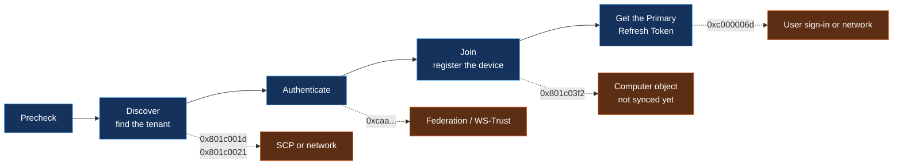

# Devices: registration, compliance and single sign-on

[← Back to the playbook](../README.md)

| # | Scenario | Typical signals |
|---|---|---|
| 14 | [Device registration or hybrid join fails](#14-device-registration-or-hybrid-join-fails) | 0x801c001d · 0x801c03f2 · event 304 |
| 15 | [Device not compliant, or no Primary Refresh Token](#15-device-not-compliant-or-no-primary-refresh-token) | 53000 · 53001 · 50155 · `AzureAdPrt : NO` |

**One command answers most device cases.** Run it as the signed-in user on the affected machine:

```cmd
dsregcmd /status
```

| Field | Healthy value | If not |
|---|---|---|
| `AzureAdJoined` | `YES` | The device never completed the join: scenario 14 |
| `DomainJoined` | `YES` for hybrid join, `NO` for Entra join | Wrong join type for this device |
| `AzureAdPrt` | `YES` | No single sign-on and device-based policies fail: scenario 15 |
| `TpmProtected` | `YES` | Keys aren't protected by the TPM; check TPM health |
| `TenantName` | Your tenant | The device is joined to a different tenant |

---

## 14. Device registration or hybrid join fails

**What you see:** the device never shows as "Microsoft Entra hybrid joined" in the portal, or stays "Pending".



The join runs in phases, and the error code tells you which phase failed.

| Phase | Code | What it means | Fix |
|---|---|---|---|
| Discover | `0x801c001d` | The device can't read the Service Connection Point in Active Directory | Create or correct the SCP (Entra Connect → Configure device options) |
| Discover | `0x801c0021` · `0x801c001f` | Can't reach the registration service, or timed out | Allow the device (in system context) to reach Microsoft's registration endpoints through the proxy |
| Discover | `0x801c003a` | Tenant not found | The SCP points to the wrong tenant |
| Network | `0x80072ee2` · `0x80072efd` · `0x80072ee7` | Timeout, can't connect, name not resolved | Proxy, firewall or DNS for the computer account |
| Authenticate | `0xcaa90017` · `0xcaa90023` · `0xcaa20003` | Federated domain: WS-Trust endpoint missing or the token wasn't accepted | Enable the WS-Trust endpoints on AD FS, or use managed authentication |
| Join | `0x801c03f2` | The directory doesn't know this device yet | The computer object hasn't synced. Check its OU is in sync scope and wait for a sync cycle |
| Join | `0x80090016` · `0x80290407` | TPM error | Update firmware or clear the TPM |

**Where to look:** Event Viewer → Applications and Services Logs → Microsoft → Windows → **User Device Registration** (events `304`, `305`, `307`, and `204` on older builds) · Entra admin center → Devices.

```cmd
dsregcmd /status            :: current state and the last error
dsregcmd /debug /leave      :: remove a broken registration (elevated prompt), then let the scheduled task re-join
```

```kusto
// Device registrations that failed in the last 7 days
AuditLogs
| where TimeGenerated > ago(7d)
| where Category == "Device" and Result != "success"
| project TimeGenerated, OperationName, ResultReason, Device = tostring(TargetResources[0].displayName)
| order by TimeGenerated desc
```

**Prevent it:** computer OUs in sync scope before rollout · a pilot ring per office network, since most failures are proxy rules.

---

## 15. Device not compliant, or no Primary Refresh Token

**What the user sees:** "You can't get there from here", "Your device must comply with your organization's requirements", or constant prompts on a company laptop.

| Cause | How to confirm | Fix |
|---|---|---|
| Device isn't compliant in Intune | `53000`; the device shows **Not compliant** with the failing setting named | Fix the setting (encryption, OS version, antivirus), then **Sync** from Company Portal |
| Compliance not evaluated yet | Device is new; compliance shows "Not evaluated" or "In grace period" | Sync and wait; consider a grace period in the policy |
| Device isn't hybrid joined but the policy requires it | `53001` | Complete the join (scenario 14), or change the policy to accept compliant devices |
| Browser doesn't pass the device identity | Works in Edge, fails in another browser | Use Edge, or install the Microsoft single sign-on extension for Chrome |
| No Primary Refresh Token | `AzureAdPrt : NO`; `50155` or `50097` in sign-in logs | Lock and unlock the device on the corporate network or VPN; check the errors below |
| Device was disabled or deleted in Entra | `135011`; the device is disabled, or missing from the Devices list | Re-enable it, or leave and re-join |
| User's password changed while off-network | The token can't refresh until the device sees a domain controller | Connect to VPN, then lock and unlock |

**Primary Refresh Token errors** appear in Event Viewer → Microsoft → Windows → **AAD** → Operational (events `1081`, `1088`):

| Code | What it means |
|---|---|
| `0xc000006d` | Sign-in to Microsoft failed (often credentials or a federation problem) |
| `0xc000006a` | Wrong password |
| `0xc000023c` · `0xc00000be` | Network unreachable from the device |
| `0xc004844c` | The user's UPN isn't in the expected format |

**Where to look:** Sign-in logs → **Device info** tab (is the device ID present, is it compliant, is it managed) · Intune → the device → Device compliance.

```kusto
// Users blocked for device reasons, and what state their device reported
SigninLogs
| where TimeGenerated > ago(24h) and ResultType in ("53000", "53001", "50155", "50097", "135011")
| project TimeGenerated, UserPrincipalName, ResultType, AppDisplayName,
          Device = tostring(DeviceDetail.displayName), OS = tostring(DeviceDetail.operatingSystem),
          Compliant = tostring(DeviceDetail.isCompliant), TrustType = tostring(DeviceDetail.trustType)
| order by TimeGenerated desc
```

**Prevent it:** a compliance grace period so new devices aren't blocked on day one · clear messages in Company Portal for each failing setting · remove stale devices on a schedule.

---

[← Hybrid identity](03-hybrid-sync.md) · [Back to the playbook](../README.md) · [Next: Access and governance →](05-access-governance.md)
