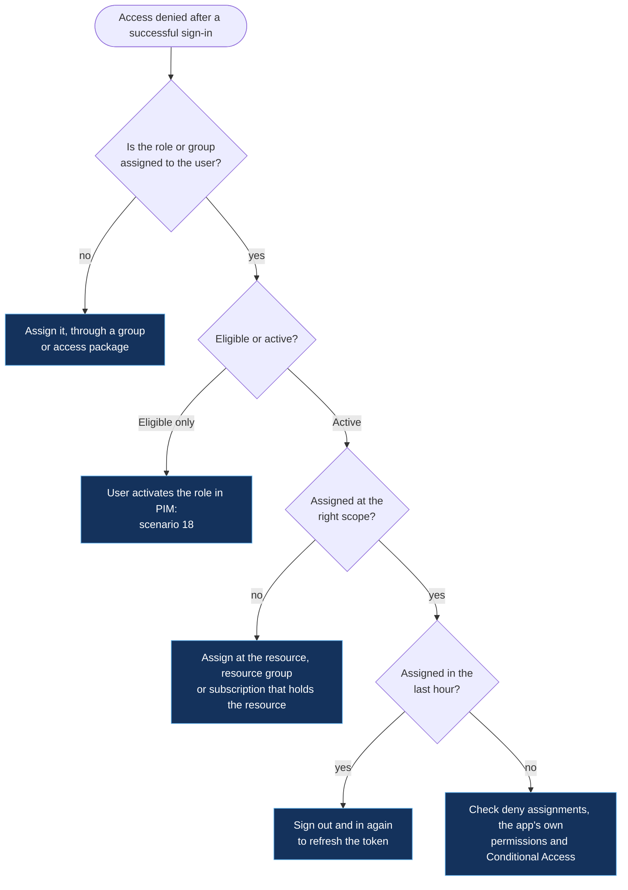

# Access, groups and governance

[← Back to the playbook](../README.md)

| # | Scenario | Typical signals |
|---|---|---|
| 16 | [User can't access an assigned resource](#16-user-cant-access-an-assigned-resource) | 403 from the resource · role not active |
| 17 | [Group membership or licence not applied](#17-group-membership-or-licence-not-applied) | Dynamic rule errors · licence assignment errors |
| 18 | [Privileged role activation fails](#18-privileged-role-activation-fails) | Activation blocked or not taking effect |
| 19 | [Access reviews not completed](#19-access-reviews-not-completed) | Review ends with "Not reviewed" |
| 20 | [Self-service password reset fails](#20-self-service-password-reset-fails) | Writeback events 31003 · 33004 · 33008 |

**Sign-in worked but access didn't?** Then this is authorization, not authentication. The sign-in logs will show success. Look at role assignments, group membership and the resource's own access control.

---

## 16. User can't access an assigned resource

**What the user sees:** signed in fine, then "Access denied", "You do not have permission" or a 403.



| Cause | How to confirm | Fix |
|---|---|---|
| Role never assigned | The user (and none of their groups) appears under Access control (IAM) | Assign the least-privileged role that covers the task |
| Role is eligible, not active | Privileged Identity Management shows the role under **Eligible assignments** | The user activates it (scenario 18) |
| Assigned at the wrong scope | The role is on a different subscription, resource group or administrative unit | Assign at the scope that contains the resource |
| Token is stale | The group or role was added minutes ago | Sign out and back in; group changes can take up to an hour to appear in tokens |
| Membership through a nested or dynamic group not applied yet | The user isn't in the group's effective membership | Scenario 17 |
| The app has its own permissions | Entra shows access; the app says no | Assign the app role, or fix the permission inside the app |
| Conditional Access blocked the resource | Sign-in log for that resource shows `53003` | [Scenario 3](01-sign-in.md#3-blocked-by-conditional-access) |

**Where to look:** the resource → Access control (IAM) → **Check access** · the user → Assigned roles and Groups · Privileged Identity Management → My roles.

```kusto
// Role and group changes for one user in the last 7 days (who changed what, and when)
AuditLogs
| where TimeGenerated > ago(7d)
| where OperationName has_any ("Add member to role", "Remove member from role", "Add member to group", "Remove member from group")
| where tostring(TargetResources) has "user@contoso.com"
| project TimeGenerated, OperationName, Result, Actor = tostring(InitiatedBy.user.userPrincipalName),
          Target = tostring(TargetResources[0].displayName)
| order by TimeGenerated desc
```

**Prevent it:** access through groups and access packages, not individual assignments · document which role is needed for each common task.

---

## 17. Group membership or licence not applied

**What you see:** a user who matches the rule isn't in the dynamic group, or is in the group but didn't get the licence.

**Dynamic groups**

| Cause | How to confirm | Fix |
|---|---|---|
| Rule hasn't finished processing | Group overview shows the processing status and the last updated time | Wait. A first run or a rule change can take up to 24 hours in a large tenant |
| The attribute doesn't hold what the rule expects | User's `department`, `country` or extension attribute is empty or spelled differently | Correct the attribute at the source (HR system or Active Directory), then let it sync |
| Rule syntax error | "Attribute not supported", "Operator isn't supported on attribute" or "Query compilation error" | Use a supported property and operator; join conditions with `-and` or `-or` |
| Rule is right, but you can't tell | — | Use **Validate rules** on the group to test specific users against the rule |

**Group-based licensing**

| Cause | How to confirm | Fix |
|---|---|---|
| Not enough licences | Group → Licenses shows users in an error state; the product has no seats left | Buy seats or free up unused ones |
| Conflicting service plans | Two products assigned to the user contain plans that can't coexist | Disable the conflicting plan in one of the assignments |
| A required plan is missing | A plan depends on another that isn't enabled | Enable the dependency |
| No usage location | The user has no **Usage location** set | Set it on the user (or sync it from on-premises) |
| Duplicate proxy address | Exchange Online can't assign the mailbox | Remove the duplicate address, then **Reprocess** |

**Where to look:** the group → Overview (processing status), Dynamic membership rules → Validate rules, Licenses → users in error · Audit logs filtered to the GroupManagement category.

```kusto
// Licence assignment failures from group-based licensing
AuditLogs
| where TimeGenerated > ago(7d)
| where OperationName has "license" and Result != "success"
| project TimeGenerated, OperationName, ResultReason, User = tostring(TargetResources[0].userPrincipalName)
| order by TimeGenerated desc
```

**Prevent it:** a single authoritative source for the attributes that rules depend on · alert when a product falls below a set number of free licences.

---

## 18. Privileged role activation fails

**What the user sees:** the **Activate** button is unavailable, activation errors out, or the role is "active" but the portal still denies them.

| Cause | How to confirm | Fix |
|---|---|---|
| Activation needs MFA and the user's session doesn't have it | Role settings require MFA or an authentication context | Sign in again with MFA, then activate |
| Activation needs approval | Request shows **Pending approval** | An approver acts on it; add a second approver so one absence doesn't block work |
| Justification or ticket number missing | Role settings require them | Supply both in the activation form |
| Eligibility expired | Role no longer appears under Eligible assignments | Renew or extend the eligible assignment |
| Activated, but access not effective yet | Activation shows success moments ago | Wait a few minutes, refresh the browser, or sign out and in |
| Eligible through a group, and the group membership itself isn't active | Role is assigned to a group managed by PIM for Groups | Activate the group membership first |

**Where to look:** Privileged Identity Management → My roles, My requests · PIM → the role → Settings · Audit logs for the PIM service.

```kusto
// PIM activations in the last 7 days and whether they succeeded
AuditLogs
| where TimeGenerated > ago(7d) and LoggedByService == "PIM"
| where OperationName has "activation"
| project TimeGenerated, OperationName, Result, ResultReason,
          User = tostring(InitiatedBy.user.userPrincipalName), Role = tostring(TargetResources[0].displayName)
| order by TimeGenerated desc
```

**Prevent it:** at least two approvers per role · activation duration that matches real task length, so people don't re-activate mid-change.

---

## 19. Access reviews not completed

**What you see:** a review closes with decisions missing, and access stays as it was.

| Cause | How to confirm | Fix |
|---|---|---|
| Reviewers didn't act | Review results show **Not reviewed** for many users | Send reminders; set a fallback reviewer |
| Wrong reviewer | The reviewer is a manager who has left, or an owner who doesn't know the users | Reassign; use "Group owners" or "Managers" with a fallback |
| Too many decisions for one person | Hundreds of users per reviewer | Split by department or app; use multi-stage reviews |
| Reviewers never saw the email | Mail went to an unmonitored mailbox or junk | Send through a monitored channel as well; share the My Access link |
| Review period too short | Period ends before reviewers have time | Lengthen the duration, or extend the running review |
| No consequence for not answering | "If reviewers don't respond" is set to **No change** | Set it to **Remove access** or **Take recommendations** |

**Where to look:** Identity Governance → Access reviews → the review → Results · Audit logs filtered to the Access Reviews service.

**Prevent it:** auto-apply results · decision helpers (recommendations based on last sign-in) turned on · quarterly cadence for privileged roles, half-yearly for standard access.

---

## 20. Self-service password reset fails

**What the user sees:** "You can't reset your own password", "We couldn't verify your account" or the reset completes in the cloud but the on-premises password doesn't change.

| Cause | How to confirm | Fix |
|---|---|---|
| User isn't enabled for self-service reset | Password reset → Properties is scoped to a group the user isn't in | Add the user's group |
| Not enough methods registered | User has one method; policy needs two | User registers another method; run a registration campaign |
| No licence for writeback | Hybrid user without the required licence | Assign the licence |
| Reset link or code expired | User returned to an old email | Start the reset again |
| Account disabled or blocked | Account status on the user | Re-enable after confirming why it was disabled |

**Password writeback (hybrid).** Look in the Application log on the Entra Connect server, source `PasswordResetService`:

| Event | Meaning | Fix |
|---|---|---|
| `31002` | Reset written to Active Directory | Working as intended |
| `31003` | Reset failed on-premises | Read the detail: policy, permissions or protected account |
| `33004` | The connector account lacks **Reset password** permission, or the user is in a protected group (`adminCount = 1`) | Grant the permission; protected admin accounts can't use writeback by design |
| `33008` | The new password doesn't meet the domain's policy (length, history, minimum age) | User picks a password that meets the policy; check minimum password age |
| `33002` | User not found on-premises | Sync problem: scenario 11 |
| `32002` | Can't connect to Service Bus | Open outbound TCP 443 to `*.servicebus.windows.net` and `*.passwordreset.microsoftonline.com` |
| `32004` · `32005` · `32010` | Configuration or encryption key problem | Disable and re-enable password writeback |

**Where to look:** Password reset → Audit logs, On-premises integration (writeback status) · Entra Connect server → Application log.

```kusto
// Self-service password reset attempts that failed, with the reason
AuditLogs
| where TimeGenerated > ago(7d) and LoggedByService == "Self-service Password Management"
| where Result != "success"
| project TimeGenerated, OperationName, ResultReason, User = tostring(TargetResources[0].userPrincipalName)
| order by TimeGenerated desc
```

**Prevent it:** combined registration for MFA and password reset · reminders to confirm methods every 180 days · a monitor on writeback heartbeat event `31019`.

---

[← Devices](04-devices.md) · [Back to the playbook](../README.md) · [Next: Risk, guests and platform →](06-risk-guests-platform.md)
