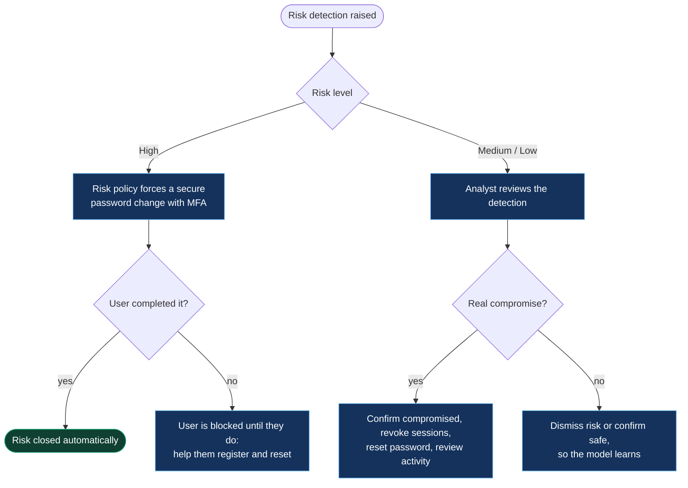

# Risk, guests and platform

[← Back to the playbook](../README.md)

| # | Scenario | Typical signals |
|---|---|---|
| 21 | [User risk detections not addressed](#21-user-risk-detections-not-addressed) | Risky users at "At risk" for days · 53004 · 50135 |
| 22 | [Guest can't sign in or redeem an invitation](#22-guest-cant-sign-in-or-redeem-an-invitation) | 50020 · 90072 · 500213 |
| 23 | [Slow sign-ins, throttling or a service incident](#23-slow-sign-ins-throttling-or-a-service-incident) | HTTP 429 · 90033 · 50196 |
| 24 | [Administrators locked out](#24-administrators-locked-out) | 53003 for every admin |

---

## 21. User risk detections not addressed

**What you see:** the Risky users report keeps growing, with users sitting at **At risk** and nobody acting on them.



| Cause | How to confirm | Fix |
|---|---|---|
| No risk-based policy, so nothing forces remediation | Conditional Access has no policy using **User risk** or **Sign-in risk** | Create them: high user risk requires a secure password change, medium or high sign-in risk requires MFA |
| Policy exists, but users can't self-remediate | Users aren't registered for MFA or password reset; sign-in shows `53004` | Run a registration campaign; give affected users a Temporary Access Pass |
| Nobody owns the queue | Detections are days old with state **At risk** | Assign an owner and a daily review; send detections to the SIEM |
| Detections dismissed in bulk without investigation | Audit log shows many "Dismiss user risk" actions together | Agree on criteria: what is confirmed safe, what is confirmed compromised |
| Noise from known sources | The same VPN or office egress triggers "unfamiliar" or "atypical travel" detections | Add trusted named locations so real detections stand out |
| Hybrid users can't change password in the cloud | Password writeback is off | Enable writeback so the secure password change completes ([scenario 20](05-access-governance.md#20-self-service-password-reset-fails)) |

**Where to look:** Identity Protection → Risky users, Risky sign-ins, Risk detections · Conditional Access policies with risk conditions.

```kusto
// Risky users still open, oldest first: the backlog nobody has dealt with
AADRiskyUsers
| where RiskState == "atRisk"
| project UserPrincipalName, RiskLevel, RiskDetail, RiskLastUpdatedDateTime,
          DaysOpen = datetime_diff("day", now(), RiskLastUpdatedDateTime)
| order by DaysOpen desc
```

```kusto
// What kinds of detection are being raised, to separate noise from signal
AADUserRiskEvents
| where TimeGenerated > ago(30d)
| summarize Detections = count(), Users = dcount(UserPrincipalName) by RiskEventType, RiskLevel
| order by Detections desc
```

**Prevent it:** automatic remediation through risk policies · high-confidence detections wired to automatic session revocation, as in the [session revocation](https://github.com/samikshya-dash/identity-security-automation/tree/main/session-revocation) project.

---

## 22. Guest can't sign in or redeem an invitation

**What the guest sees:** "User account … does not exist in tenant", "This invitation has already been redeemed", or a block message naming their own organisation.

| Cause | How to confirm | Fix |
|---|---|---|
| The guest was never invited, or is signing in with a different account | `50020` or `90072`; the email they use differs from the invited address | Invite the address they actually sign in with, or have them switch accounts |
| Your tenant's inbound settings block their organisation | `500213` (not allowed by the resource tenant's cross-tenant access policy) | Allow that organisation, or the specific users, in cross-tenant access settings |
| Their organisation blocks outbound access to you | They are blocked before reaching your tenant; the message names their admin | Their administrator must allow outbound access to your tenant |
| Invitation redeemed with the wrong identity | Guest's user object shows an unexpected identity provider | Reset the redemption status and resend |
| Conditional Access needs a compliant device a guest can't have | `53000` or `53003` for guest users | Trust the guest's home-tenant MFA and device claims, or scope the policy to exclude guests with a compensating control |
| Guest account disabled or expired by an access review | Account enabled is off; audit log shows the review removal | Re-invite if access is still needed |

**Where to look:** Users → filter **Guest** · External Identities → Cross-tenant access settings · Sign-in logs → **Cross-tenant access type** column.

```kusto
// Guest sign-in failures, grouped by the guest's home organisation
SigninLogs
| where TimeGenerated > ago(7d) and UserType == "Guest" and ResultType != "0"
| extend HomeDomain = tostring(split(UserPrincipalName, "@")[1])
| summarize Failures = count(), Guests = dcount(UserPrincipalName) by HomeDomain, ResultType, ResultDescription
| order by Failures desc
```

**Prevent it:** access packages for partners, so invitation, approval and expiry are one process · agree cross-tenant settings with each partner before the project starts.

---

## 23. Slow sign-ins, throttling or a service incident

**What you see:** sign-ins are slow or time out for many users at once, or scripts and apps receive HTTP `429`.

Entra ID is a shared service, so you don't size or scale it. "Performance" problems are one of four things:

| Cause | How to confirm | Fix |
|---|---|---|
| Microsoft service incident | Service health shows an active advisory or incident; `90033` (directory service unavailable) in sign-in logs | Nothing to fix on your side. Tell users, follow the incident and record the impact |
| An app or script is being throttled | HTTP `429` with a `Retry-After` header from Microsoft Graph | Honour `Retry-After`, batch requests, use delta queries instead of full reads |
| A client is stuck in a loop | `50196` (loop detected) for one app or device | Fix or update the client; clear its token cache |
| The delay is on your side | Entra responds fast; the time is spent at AD FS, a pass-through agent, a proxy or a third-party MFA provider | Check the component in the path: [scenario 12](03-hybrid-sync.md#12-password-sync-or-pass-through-authentication-failing) or [13](03-hybrid-sync.md#13-federated-sign-in-failure-ad-fs) |
| Very large tokens | Users in hundreds of groups; apps fail with header-size errors | Emit only groups assigned to the app, or use app roles |

**Where to look:** Entra admin center → Service health · Microsoft 365 admin center → Service health · Sign-in logs → the **Latency** information on a sign-in.

```kusto
// Is it everyone or one app? Failure rate per hour over the last day
SigninLogs
| where TimeGenerated > ago(24h)
| summarize Total = count(), Failed = countif(ResultType !in ("0", "50140", "50199")) by bin(TimeGenerated, 1h)
| extend FailureRate = round(100.0 * Failed / Total, 1)
| order by TimeGenerated asc
```

**Prevent it:** retry logic with back-off in every script and app · subscribe to service health alerts · avoid a single on-premises dependency for cloud sign-in.

---

## 24. Administrators locked out

**What you see:** a Conditional Access change blocks every administrator, including the one who made it.

| Step | Action |
|---|---|
| 1 | Sign in with a **break-glass account**. It is cloud-only, excluded from every Conditional Access policy, and its credential is stored offline |
| 2 | Open Conditional Access, find the policy changed most recently (Audit logs show who and when) and set it to **Report-only** |
| 3 | Confirm a normal administrator can sign in again |
| 4 | Review why the policy matched administrators, fix the scope, test with **What If**, then re-enable |
| 5 | Record the break-glass use and rotate its credential |

**No break-glass account?** Another Global Administrator on an unaffected network or device may still get in. If nobody can, open a case with Microsoft support; identity verification takes time, so this is the slow path.

```kusto
// Every sign-in by the break-glass accounts. Any result here should raise an alert
SigninLogs
| where TimeGenerated > ago(90d)
| where UserPrincipalName in~ ("breakglass1@contoso.onmicrosoft.com", "breakglass2@contoso.onmicrosoft.com")
| project TimeGenerated, UserPrincipalName, ResultType, IPAddress, AppDisplayName
| order by TimeGenerated desc
```

**Prevent it:** two break-glass accounts with phishing-resistant credentials · both excluded from every policy · an alert on any sign-in by either · a sign-in test every 90 days.

---

[← Access and governance](05-access-governance.md) · [Back to the playbook](../README.md)
