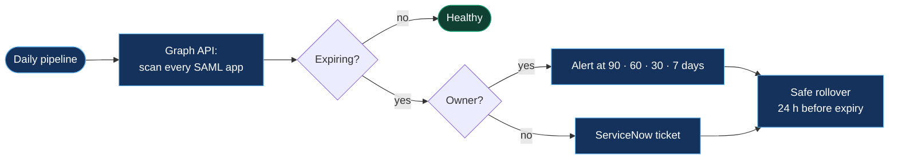

  

  
  
  

I'm an identity security architect at Accenture with 9+ years in tech. I lead security delivery for 15+ enterprise clients and own the roadmap for a consumer identity platform used by 100M+ people across 9 markets. When the same problem shows up in the ticket queue twice, I write code so it doesn't show up a third time.

  

## 🛡️ What I work on

| Area | Stack |
|---|---|
| **Identity & Zero Trust** |       |
| **Cloud security** |    |
| **Detection & response** |    |
| **AI security** | -6B46C1?style=flat-square&logo=microsoft&logoColor=white)   |
| **Automation** |       |

## 🔧 Things I've built at work

Client code stays with clients, so I rebuilt five of them as public, runnable versions with synthetic data, flow diagrams and the design decisions behind each one. **[See the full repository →](https://github.com/samikshya-dash/identity-security-automation)**

| | Project | What changed in production |
|---|---|---|
| 📜 | [**SAML certificate lifecycle**](https://github.com/samikshya-dash/identity-security-automation/tree/main/saml-cert-lifecycle) · Graph API, Python, Bitbucket CI/CD, ServiceNow | Priority SSO outages **−92%** |
| 🔑 | [**Secrets scanner**](https://github.com/samikshya-dash/identity-security-automation/tree/main/secrets-scanner) · regex + entropy, pre-commit, CI gate | **77** leaked secrets caught in **37** repos before production |
| 🤖 | [**Self-healing operations**](https://github.com/samikshya-dash/identity-security-automation/tree/main/self-healing-ops) · n8n agentic AI with guardrails | **−67%** effort, about **60 h/month** saved |
| 📨 | [**GDPR request automation**](https://github.com/samikshya-dash/identity-security-automation/tree/main/gdpr-dsr-automation) · OneTrust, Event Hub, Python | **4,000–6,000** requests/month, **2–3 h/day** freed |
| ⚡ | [**Session revocation**](https://github.com/samikshya-dash/identity-security-automation/tree/main/session-revocation) · Sentinel KQL, Logic Apps, Graph | Compromised sessions killed in **under 2 s** |
| 📖 | [**Entra ID troubleshooting playbook**](https://github.com/samikshya-dash/entra-id-troubleshooting-playbook) · 24 scenarios, real error codes, KQL | From the error on screen to the cause and the fix |

### How the SAML lifecycle works

## 📚 Learning right now

Executive Diploma in Machine Learning & AI at **IIIT Bengaluru** (finishing 2027), with a focus on securing AI agents.

## 🏅 Certifications

