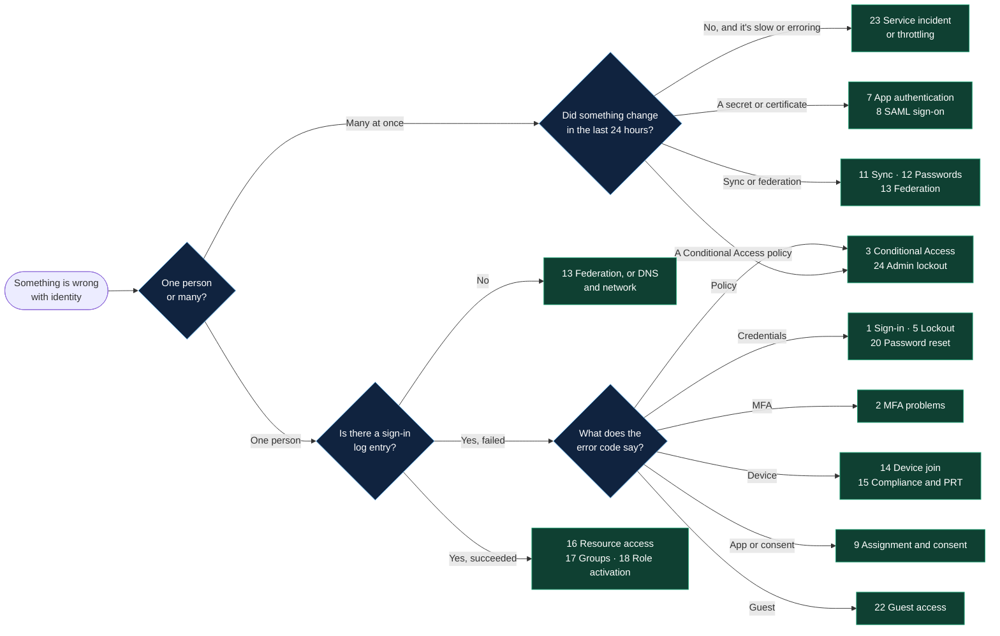
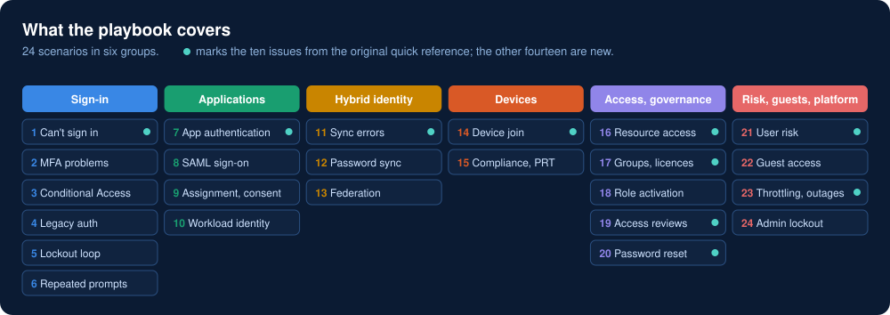
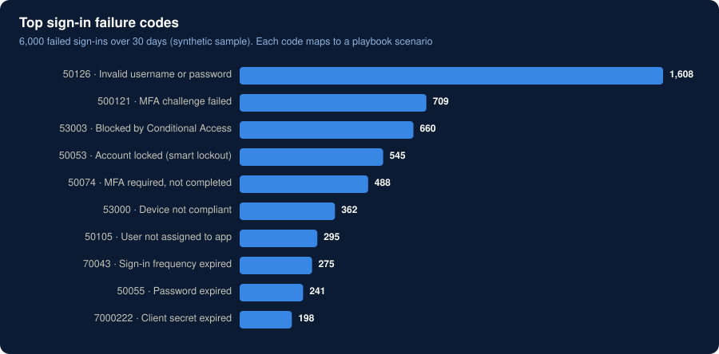
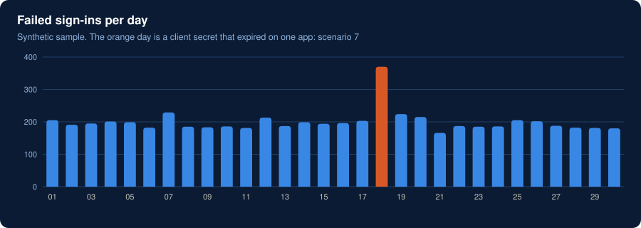

<p align="center">
  
</p>

A working playbook for the identity problems that fill a support queue: what the user sees, what it usually is, how to prove it, how to fix it and how to stop it coming back. It covers Microsoft Entra ID (formerly Azure AD), hybrid identity with Entra Connect, devices and governance.

It started as a one-page quick reference with ten issues. This version keeps those ten, adds fourteen more, and replaces the placeholder event codes with the real error codes, event IDs and log queries you will meet in a tenant.

## How to use it

1. **Get the error code.** Open the failed attempt in the sign-in logs, or ask for the code on the user's screen.
2. **Look it up** in the [error code lookup](error-codes.md). It names the scenario.
3. **Follow the scenario.** Each one gives the causes, how to confirm each cause, the fix, a query and how to prevent it.

No code yet? Start with the triage flow below.

## Triage: which scenario is this?



## Where a sign-in can fail

<p align="center">
  
</p>

## What the playbook covers

<p align="center">
  
</p>

## Quick reference

| # | Issue | Most likely causes | First thing to check | Real codes and events |
|---|---|---|---|---|
| | **[Sign-in](scenarios/01-sign-in.md)** | | | |
| 1 | [User can't sign in](scenarios/01-sign-in.md#1-user-cant-sign-in) | Wrong or expired password, disabled account, wrong tenant | The error code on the failed sign-in | `50126` `50034` `50055` `50057` |
| 2 | [MFA problems](scenarios/01-sign-in.md#2-mfa-problems) | Prompt not received, new phone, nothing registered | Sign-in → Authentication details | `50074` `50076` `500121` `50158` |
| 3 | [Blocked by Conditional Access](scenarios/01-sign-in.md#3-blocked-by-conditional-access) | Location, device or app outside policy; untested new policy | Sign-in → Conditional Access tab | `53003` `530032` |
| 4 | [Legacy authentication blocked](scenarios/01-sign-in.md#4-legacy-authentication-blocked) | Old mail client, scanner or script using a password | **Client app** column in sign-in logs | `53003` with a legacy client |
| 5 | [Account lockout loop](scenarios/01-sign-in.md#5-account-lockout-loop) | Saved old password on a device, password spray | Which device or IP sends the bad passwords | `50053` · event `4740` |
| 6 | [Repeated sign-in prompts](scenarios/01-sign-in.md#6-repeated-sign-in-prompts) | Sign-in frequency policy, revoked session, no device token | Non-interactive sign-in logs | `70043` `50133` `50173` `700082` |
| | **[Applications](scenarios/02-applications.md)** | | | |
| 7 | [App fails to authenticate](scenarios/02-applications.md#7-app-fails-to-authenticate) | Expired secret, wrong reply URL, wrong client ID | Certificates & secrets on the app registration | `7000222` `7000215` `50011` `700016` |
| 8 | [SAML single sign-on failure](scenarios/02-applications.md#8-saml-single-sign-on-failure) | Signing certificate rotated, identifier or claim mismatch | Which side shows the error: Microsoft or the app | `75011` `75005` `50008` |
| 9 | [Not assigned, or consent missing](scenarios/02-applications.md#9-user-not-assigned-or-consent-missing) | User not assigned, nested group, admin consent needed | Users and groups on the enterprise app | `50105` `65001` `90094` |
| 10 | [Workload identity failing](scenarios/02-applications.md#10-service-principal-or-workload-identity-failing) | Expired credential, missing role, policy block | Service principal sign-in logs | `7000222` `7000215` `53003` |
| | **[Hybrid identity](scenarios/03-hybrid-sync.md)** | | | |
| 11 | [Directory sync errors](scenarios/03-hybrid-sync.md#11-directory-sync-errors) | Duplicate attributes, object out of scope, scheduler off | Sync errors in Connect Health | `AttributeValueMustBeUnique` `InvalidSoftMatch` |
| 12 | [Password sync or pass-through failing](scenarios/03-hybrid-sync.md#12-password-sync-or-pass-through-authentication-failing) | Sync stopped, agent offline, temporary password | Heartbeat event every 30 minutes | events `654` `611` `655` |
| 13 | [Federated sign-in failure](scenarios/03-hybrid-sync.md#13-federated-sign-in-failure-ad-fs) | Token-signing certificate, AD FS down, claim rule | Whether Entra logged the attempt at all | `50107` `50008` · AD FS `364` |
| | **[Devices](scenarios/04-devices.md)** | | | |
| 14 | [Device registration fails](scenarios/04-devices.md#14-device-registration-or-hybrid-join-fails) | Connection point missing, proxy, computer not synced | `dsregcmd /status` | `0x801c001d` `0x801c03f2` · event `304` |
| 15 | [Not compliant, or no device token](scenarios/04-devices.md#15-device-not-compliant-or-no-primary-refresh-token) | Compliance setting failing, device disabled, off-network | Sign-in → Device info tab | `53000` `53001` `50155` `135011` |
| | **[Access and governance](scenarios/05-access-governance.md)** | | | |
| 16 | [Can't access an assigned resource](scenarios/05-access-governance.md#16-user-cant-access-an-assigned-resource) | Role missing, eligible but not active, wrong scope | **Check access** on the resource | 403 after a successful sign-in |
| 17 | [Group or licence not applied](scenarios/05-access-governance.md#17-group-membership-or-licence-not-applied) | Rule still processing, attribute wrong, no licences left | Processing status on the group | Rule and licence assignment errors |
| 18 | [Role activation fails](scenarios/05-access-governance.md#18-privileged-role-activation-fails) | MFA, approval or ticket required; eligibility expired | Role settings in PIM | PIM audit entries |
| 19 | [Access reviews not completed](scenarios/05-access-governance.md#19-access-reviews-not-completed) | Wrong or overloaded reviewers, no default action | Review results: "Not reviewed" count | Access review audit entries |
| 20 | [Password reset fails](scenarios/05-access-governance.md#20-self-service-password-reset-fails) | Not enabled, methods missing, writeback broken | Password reset audit log | events `31003` `33004` `33008` |
| | **[Risk, guests and platform](scenarios/06-risk-guests-platform.md)** | | | |
| 21 | [User risk not addressed](scenarios/06-risk-guests-platform.md#21-user-risk-detections-not-addressed) | No risk policy, users can't self-remediate, no owner | Risky users still "At risk" | `53004` `50135` |
| 22 | [Guest can't sign in](scenarios/06-risk-guests-platform.md#22-guest-cant-sign-in-or-redeem-an-invitation) | Wrong account, cross-tenant settings, device rule | Cross-tenant access settings | `50020` `90072` `500213` |
| 23 | [Slow, throttled or outage](scenarios/06-risk-guests-platform.md#23-slow-sign-ins-throttling-or-a-service-incident) | Service incident, app throttled, client loop | Service health | HTTP `429` · `90033` `50196` |
| 24 | [Administrators locked out](scenarios/06-risk-guests-platform.md#24-administrators-locked-out) | Conditional Access change that caught admins | Break-glass account sign-in | `53003` for every admin |

## The first five minutes

Ask these before touching any setting. They decide which scenario you are in.

| Question | Why it matters |
|---|---|
| Who is affected: one person, one team, one app or everyone? | One person is their account or device. Everyone is configuration or the service |
| What exactly is on the screen, including the code and the correlation ID? | The code names the checkpoint that failed; the correlation ID finds the log entry |
| When did it last work, and what changed since? | Most outages follow a change: policy, certificate, secret, sync rule |
| Which app, device, network and browser? | Separates device and policy problems from account problems |
| Does it work another way: another browser, device or network? | Each "yes" removes a whole group of causes |

## Find what is hurting most

`triage.py` reads an export of failed sign-ins, ranks the failure codes, points each to its scenario and flags sudden spikes. It runs on a synthetic sample here, and on your own export if you pass the file.

```bash
python triage.py
```





In the sample, one day stands out. The script reports it as 198 failures of `7000222` on a single app: a client secret that expired overnight, which is scenario 7.

## When to escalate

| Severity | Looks like | Response |
|---|---|---|
| **P1** | All users or all admins can't sign in; sync or federation down for a business-critical app | Incident bridge at once. Check service health, the last change and break-glass access |
| **P2** | One app or one site is down; many users blocked by a policy | Roll the change back or set the policy to Report-only, then investigate |
| **P3** | One user or one device | Follow the scenario; fix at source |
| **Security** | Unexpected MFA prompts, risky sign-ins that succeeded, lockouts from many countries | Treat as an attack, not a support ticket. Revoke sessions, reset credentials, hand to security operations |

Raise a Microsoft support case when service health shows an incident affecting you, when codes point to the service (`90033`), or when a fix needs Microsoft to act. Include the **correlation ID, request ID and timestamp** from the failed sign-in.

## What's in this folder

| File | Contents |
|---|---|
| [`scenarios/`](scenarios/) | The 24 scenarios in six pages, each with causes, confirmation steps, fixes, queries and prevention |
| [`error-codes.md`](error-codes.md) | Lookup from code or event ID to plain meaning and scenario |
| [`triage.py`](triage.py) | Ranks failure codes in a sign-in export and flags spikes |
| [`data/`](data/) | Synthetic sign-in failures (6,000 rows) used by the script, rebuilt by [`tools/generate_dataset.py`](tools/generate_dataset.py) |

All sample data is synthetic. Error codes and event IDs are taken from Microsoft's documentation; portal names change often, so menu paths are described by feature name.

## About me

Identity security architect at Accenture · [GitHub](https://github.com/samikshya-dash) · [LinkedIn](https://www.linkedin.com/in/samikshya-dash-cybersecurity) · smkshy@hotmail.com

More of my work: [identity-security-automation](https://github.com/samikshya-dash/identity-security-automation), five identity automations rebuilt with synthetic data.
